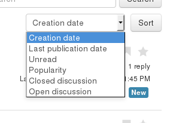

# Forum Improved

Copyright 2016 University Paris Descartes

Forum Improved is a evolution of the forum moodle module based on [Advanced Forum](https://github.com/moodlerooms/moodle-mod_hsuforum/)

What's new ? Why "Improved" ?
-----------------------------

First, we are based on Advanced Forum , so we have all the improvement of Advanced Forum.

More, we disable subscriptions, by default, and users can vote for posts, using a "+1" button.

Moreover, teachers can close a discussion when hey thought that the question is setled.

Furthermore, users can sort with some new criterias.

Support
-------

We cannot offer direct support. Please do not contact us directly. If you
need assistance, try the forum on moodle.org. (Remember to make clear
that you are using Forum Improved and not the standard forum.)

You can search a fix on Advenced Forum or HsuForum, in most case, it will works.

Bug reports
-----------

Please report bugs to the Moodle tracker using the 'contributed code' project
and 'Module: Forum Improved' component. Under Version, please select your Moodle
version e.g. 2.1, 2.2.

Requires
--------

* Moodle 2.7+
* PostGreSQL or MySQL/MariaDB

Tests on :
* Moodle 2.7
* With MariaDB 10.0.23

Please note that this code is tested on Paris Descates university's systems but
we rely on the community for testing on other systems.

Install
-------

Place the contents of this source tree into your Moodle installation so that
within your Moodle root, this file is mod/forumimproved/README.md. Then visit the
Moodle notifications page to install.

How to build
------------

You need to build **ONLY** if you want to contribute. In this case, follow this steps:

1. Intall [grunt](http://gruntjs.com/getting-started#installing-the-cli)
2. Install the npm dependancies, using the command `npm install`
3. Build with the command `grunt`
4. Enjoy :D

Documentation
-------------

Currently none.  
DIY. I wait you pull-request ;)

Credits
-------

The logo came from Google Material Icons.  
This module is under [GNU GPL v2.0](LICENSE).
